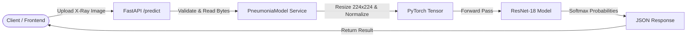

# 🫁 Pneumonia Detection API

[](https://www.python.org/)
[](https://fastapi.tiangolo.com/)
[](https://pytorch.org/)
[](LICENSE)

A high-performance, production-ready REST API for automated pneumonia detection from chest X-ray images, powered by **FastAPI** and a fine-tuned **PyTorch ResNet-18** deep learning model.

---

## 📌 Overview

Pneumonia is an inflammatory condition of the lung affecting primarily the small air sacs known as alveoli. Early and accurate diagnosis is critical for effective treatment.

This project provides an end-to-end deep learning pipeline and microservice:
- **Model Training**: Transfer learning and fine-tuning on chest X-ray radiographs with class imbalance handling.
- **RESTful API**: Fast, asynchronous image classification returning class probabilities for `NORMAL` vs `PNEUMONIA`.
- **Developer-Friendly**: Interactive OpenAPI documentation, CORS middleware enabled, and flexible deployment options.

---

## ✨ Key Features

- **⚡ Fast Inference**: Pre-loaded model in FastAPI lifespan context for low-latency predictions.
- **🎯 High Clinical Recall**: Model optimized for high sensitivity (~99% recall on pneumonia cases) to minimize false negatives in medical screening.
- **🛡️ Input Validation**: Automatic file type verification (supports `image/jpeg` and `image/png`) and robust error handling.
- **🔄 Device Agnostic**: Seamlessly runs on NVIDIA CUDA GPUs when available, with automatic fallback to CPU.
- **📖 Auto-Generated Documentation**: Built-in Swagger UI and ReDoc for immediate testing and integration.

---

## 🏗️ Project Architecture

```text
pneumonia-api/
├── main.py                          # FastAPI application & API endpoints
├── model_service.py                 # PyTorch model wrapper, preprocessing & inference
├── pneumonia_resnet18_weights.pth   # Serialized model checkpoint weights
├── pyproject.toml                   # Project metadata & dependencies
├── uv.lock                          # Deterministic dependency lockfile
├── notebooks/
│   └── chest_xray_diagnosis.ipynb   # Model training, augmentation & evaluation pipeline
└── README.md                        # Documentation
```

### Inference Flow



---

## 📊 Model Performance

The classifier is built on a **ResNet-18** backbone with custom classification head (Dropout + Linear) fine-tuned on the Chest X-Ray dataset:

| Class | Precision | Recall | F1-Score | Support |
| :--- | :---: | :---: | :---: | :---: |
| **NORMAL** | 0.98 | 0.58 | 0.73 | 234 |
| **PNEUMONIA** | 0.80 | **0.99** | **0.88** | 390 |
| **Overall Accuracy** | — | — | **84%** | 624 |

> **Note**: In medical screening, prioritizing a high **Recall (99%)** for the positive class (Pneumonia) ensures that infected patients are reliably flagged for clinical review.

---

## 🚀 Quick Start

### Prerequisites

- Python `>= 3.11`
- [uv](https://github.com/astral-sh/uv) (recommended) or standard `pip`

### 1. Clone & Setup

```bash
git clone https://github.com/muhammadsaad-dev/pneumonia-api.git
cd pneumonia-api
```

### 2. Install Dependencies

Using **uv** (recommended for ultra-fast setup):
```bash
uv sync
```

Using standard **pip / venv**:
```bash
python -m venv .venv
source .venv/bin/activate   # On Windows: .venv\Scripts\activate
pip install -e .
```

---

## 🖥️ Running the API

Start the Uvicorn server:

```bash
uv run uvicorn main:app --reload --port 8000
```
*(Or if using standard venv: `uvicorn main:app --reload --port 8000`)*

The server will initialize at `http://127.0.0.1:8000`.

### Interactive API Documentation

Once the server is running, explore the interactive documentation:
- **Swagger UI**: [http://127.0.0.1:8000/docs](http://127.0.0.1:8000/docs)
- **ReDoc**: [http://127.0.0.1:8000/redoc](http://127.0.0.1:8000/redoc)

---

## 📡 API Reference

### Health Check

- **Endpoint**: `GET /`
- **Description**: Verify service availability.

**Response:**
```json
{
  "message": "Pneumonia Detection API is running. Use /predict to test."
}
```

---

### Predict X-Ray

- **Endpoint**: `POST /predict`
- **Content-Type**: `multipart/form-data`
- **Accepted Files**: `.jpeg`, `.jpg`, `.png`

#### cURL Example

```bash
curl -X POST "http://127.0.0.1:8000/predict" \
     -H "accept: application/json" \
     -H "Content-Type: multipart/form-data" \
     -F "file=@/path/to/chest_xray.jpeg"
```

#### Python Example

```python
import requests

url = "http://127.0.0.1:8000/predict"
file_path = "chest_xray.jpeg"

with open(file_path, "rb") as f:
    files = {"file": (file_path, f, "image/jpeg")}
    response = requests.post(url, files=files)

print(response.json())
```

#### Sample Response

```json
{
  "NORMAL": 0.0142,
  "PNEUMONIA": 0.9858
}
```

---

## 🔬 Model Training & Experimentation

The complete training and validation pipeline is available in [notebooks/chest_xray_diagnosis.ipynb](notebooks/chest_xray_diagnosis.ipynb):
- Data augmentation (Random Rotation, Affine transformations, ColorJitter)
- Class-weighted CrossEntropyLoss to address class distribution skew
- Adam optimization with learning rate schedule
- Training loss/accuracy curves and confusion matrix evaluation

---

## ⚠️ Disclaimer

> [!WARNING]
> This application and its associated models are developed for **educational and research purposes only**. It is not certified as a medical device and should not be used as a standalone diagnostic tool or a substitute for professional medical judgment.
